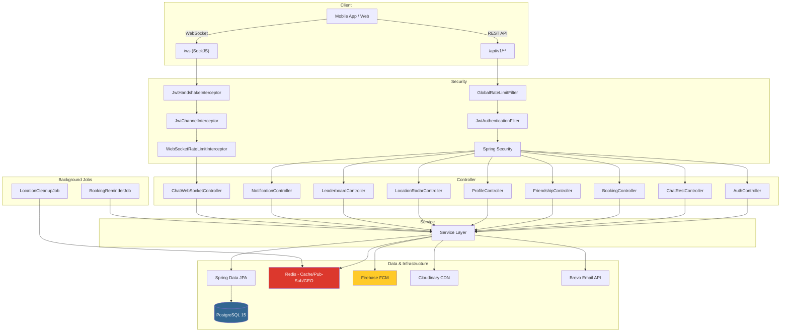
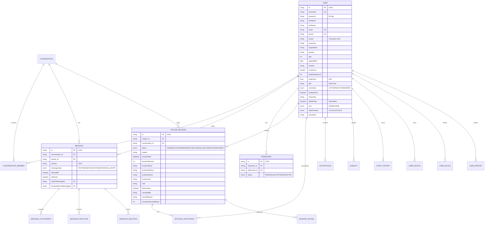
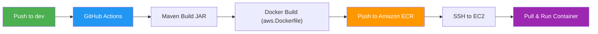

# 🗣️ StudyDate-BE

<div align="center">

[](https://spring.io/projects/spring-boot)
[](https://www.oracle.com/java/)
[](https://www.postgresql.org/)
[](https://redis.io/)
[](https://www.docker.com/)
[](https://aws.amazon.com/)

**Backend RESTful API cho nền tảng kết nối bạn học — StudyDate**

[Tính Năng](#-tính-năng-chính) • [Cài Đặt](#-cài-đặt-local) • [Docker](#-docker-deployment) • [API Docs](#-api-documentation) • [Kiến Trúc](#%EF%B8%8F-kiến-trúc) • [CI/CD](#-cicd--aws-deployment)

</div>

---

## 📖 Giới Thiệu

StudyDate-BE là backend API của nền tảng **StudyDate** — ứng dụng kết nối cộng đồng người học, giúp sinh viên tìm bạn học cùng, đặt lịch gặp mặt offline và trao đổi qua chat realtime. Được phát triển bằng Spring Boot 3.2.2 với kiến trúc layered, ứng dụng cung cấp:

- **Chat realtime** qua WebSocket/STOMP (endpoint `/ws` với SockJS)
- **Đặt lịch học offline** (Booking) trong conversation với nhắc nhở tự động
- **Radar tìm bạn** quanh khu vực dựa trên GPS lưu trữ trong Redis
- **Hệ thống EXP & Danh hiệu** gamification khuyến khích hoạt động
- **Bảo mật JWT** (Access Token + Refresh Token), rate limiting Bucket4j
- **Deploy tự động** lên AWS EC2 qua GitHub Actions CI/CD

### 🎯 Điểm Nổi Bật

- **💬 Chat Realtime** — WebSocket/STOMP, hỗ trợ reply, forward, pin, reaction, recall, file đính kèm
- **📅 Đặt Lịch Học Offline** — Tạo booking trong cuộc trò chuyện, nhắc nhở và hết hạn tự động
- **📍 Radar GPS** — Tìm người dùng quanh khu vực, TTL tự động xóa vị trí cũ
- **🏆 EXP & Danh Hiệu** — Tích điểm qua hoạt động, mở khóa danh hiệu từ "Siêu Tân Binh" → "Lão Làng"
- **🔒 Bảo Mật Toàn Diện** — JWT, BCrypt, Rate Limiting (Bucket4j + Redis), IP Abuse Tracking
- **🐳 Docker & CI/CD** — Deploy tự động lên AWS EC2 (ECR + GitHub Actions)

---

## ✨ Tính Năng Chính

### 💬 Chat Realtime (WebSocket/STOMP)
- **WebSocket Endpoint**: `/ws` (SockJS), prefix `/app`, broker `/topic` & `/queue`
- **Chat 1-1 và Nhóm**: Hỗ trợ `DIRECT` và `GROUP` (tối đa 30 thành viên)
- **Loại Tin Nhắn**: `TEXT`, `IMAGE`, `FILE`, `SYSTEM`, `SCHEDULE_INVITE`
- **Reply & Forward**: Trả lời và chuyển tiếp tin nhắn đến cuộc trò chuyện khác
- **Pin/Unpin**: Ghim tin nhắn quan trọng trong conversation
- **Emoji Reaction**: Thả reaction emoji cho tin nhắn
- **Recall**: Thu hồi tin nhắn trong vòng 30 phút (`chat.recall-timeout-minutes=30`)
- **Xóa Tin Nhắn**: Xóa tin nhắn phía mình (delete for me)
- **Upload File**: Đính kèm file/ảnh qua Cloudinary (tối đa 50MB)
- **Schedule Invite**: Gửi lời mời hẹn lịch trong cuộc trò chuyện
- **Tìm kiếm**: Search conversations và messages theo keyword
- **Quản lý Nhóm**: Tạo/cập nhật/giải tán nhóm, thêm/xóa thành viên, chuyển quyền owner
- **Typing Indicator**: Hiển thị trạng thái đang gõ realtime
- **Read Receipt**: Đánh dấu đã đọc tin nhắn
- **Redis Pub/Sub**: `ChatRedisSubscriber` đồng bộ tin nhắn giữa nhiều instance

### 📅 Booking — Đặt Lịch Học Offline
- **Tạo Booking**: Đặt lịch trong conversation (`/api/v1/bookings/conversation/{conversationId}`)
- **Vòng Đời Booking**: `PENDING` → `CONFIRMED` → `COMPLETED` (hoặc `REJECTED`/`CANCELLED`/`EXPIRED`)
- **Accept/Reject**: Người được mời chấp nhận hoặc từ chối lời mời
- **Cancel**: Hủy booking với lý do, ghi nhận `cancelledBy` và `cancelReason`
- **Complete & Rate**: Hoàn thành booking rồi đánh giá partner (trust score + EXP)
- **Weekly Schedule**: Xem lịch booking theo tuần (`/api/v1/bookings/weekly?weekStart=...`)
- **Thông tin Địa điểm**: `locationName`, `locationAddress`, `locationDistrict`, `locationCity`
- **Scheduled Jobs** (tự động chạy nền):
  - `expirePendingBookings()` — mỗi 5 phút, hết hạn booking PENDING quá 30 phút
  - `sendBookingReminders()` — mỗi 15 phút, gửi nhắc nhở trước buổi hẹn 60 phút (Push + WebSocket)
  - `expireConfirmedBookings()` — mỗi 1 giờ, hết hạn booking CONFIRMED quá 24 giờ

### 👥 Bạn Bè (Friendship)
- **Gửi Lời Mời Kết Bạn**: `POST /api/v1/friends/request/{targetUserId}`
- **Chấp Nhận/Từ Chối**: Accept hoặc Reject friend request
- **Hủy Kết Bạn**: Unfriend
- **Danh Sách Bạn Bè**: Phân trang, tìm kiếm bạn theo tên
- **Lời Mời Đang Chờ**: Xem danh sách pending requests
- **Tìm Kiếm Người Dùng**: Search theo email, SĐT hoặc tên (`/api/v1/users/search`)
- **Redis Pub/Sub**: `FriendshipRedisSubscriber` thông báo realtime khi có friend request

### 📍 Radar — Tìm Bạn Quanh Đây
- **Scan Radar**: `GET /api/v1/location/radar?lat=...&lng=...&radius=5` (mặc định 5km, tối đa 50km)
- **Update GPS**: Cập nhật vị trí vào Redis GEO
- **Remove GPS**: Xóa vị trí khỏi Radar
- **TTL Tự Động**: Vị trí hết hạn sau 30 phút (cấu hình `radar.ttl-minutes`)
- **Cleanup Job**: `LocationCleanupJob` chạy mỗi 5 phút, dọn dẹp vị trí đã hết TTL
- **Buddy Status**: Bật/tắt trạng thái buddy (`buddyActive`) để hiển thị trên Radar

### 🏆 EXP & Bảng Xếp Hạng (Leaderboard)
- **Tích/Trừ Điểm EXP** theo hoạt động:

  | Hành Động | EXP | Mô Tả |
    |-----------|-----|-------|
  | `BOOKING_COMPLETED` | +20 | Hoàn thành lịch hẹn |
  | `RATING_5_STAR_RECEIVED` | +10 | Nhận đánh giá 5 sao |
  | `BOOKING_RATED` | +5 | Đánh giá partner |
  | `FRIENDSHIP_ACCEPTED` | +3 | Kết bạn thành công |
  | `DAILY_FIRST_MESSAGE` | +1 | Tin nhắn đầu tiên trong ngày |
  | `BOOKING_CANCELLED` | -10 | Hủy lịch hẹn |
  | `BOOKING_REJECTED` | -5 | Lịch hẹn bị từ chối |
  | `BOOKING_EXPIRED` | -5 | Lịch hẹn hết hạn |
  | `RATING_1_STAR_RECEIVED` | -3 | Nhận đánh giá 1 sao |

- **Hệ Thống Danh Hiệu**:

  | Danh Hiệu | EXP Yêu Cầu |
    |-----------|-------------|
  | ⭐ Siêu Tân Binh | 0 — 199 |
  | ⭐⭐ Tân Binh Kỳ Cựu | 200 — 599 |
  | 💎 Có Công Mài Sắt | 600 — 799 |
  | 🔥 Cộng Sự Siêu Đẳng | 800 — 999 |
  | 👑 Lão Làng | 1000+ |

- **Bảng Xếp Hạng**: `GET /api/v1/leaderboard/top` (phân trang)
- **Xem Rank Cá Nhân**: `GET /api/v1/leaderboard/me`
- **Lịch Sử EXP**: `GET /api/v1/leaderboard/history`

### 👤 Hồ Sơ Cá Nhân (Profile)
- **Xem Profile Công Khai**: `GET /api/v1/profile/{userId}`
- **Cập Nhật Thông Tin**: Tên, email, SĐT, giới tính, ngày sinh
- **Thông Tin Học Tập**: Trường đại học (`university`), chuyên ngành (`majorName`)
- **Môn Học (Subjects)**: Thêm/xem/xóa môn học quan tâm (type + name)
- **Avatar**: Upload ảnh đại diện qua Cloudinary
- **Buddy Status**: Bật/tắt trạng thái tìm bạn
- **Status Tag**: Cập nhật dòng trạng thái cá nhân
- **Cập Nhật Vị Trí**: Location (tỉnh/thành phố)
- **Đổi Mật Khẩu**: Thay đổi mật khẩu tài khoản
- **Xóa Tài Khoản**: Soft delete (`deleteFlag`)

### 🔔 Thông Báo (Notification)
- **Push Notification**: Gửi thông báo đẩy qua Firebase Cloud Messaging (FCM)
- **In-App Notification**: Realtime qua Redis Pub/Sub (`NotificationRedisSubscriber`)
- **Các Loại Thông Báo**: `FRIEND_REQUEST_RECEIVED`, `FRIEND_REQUEST_ACCEPTED`, `BOOKING_INVITE`, `BOOKING_ACCEPTED`, `BOOKING_REJECTED`, `BOOKING_CANCELLED`, `BOOKING_REMINDER`
- **Quản Lý**: Xem danh sách (phân trang), đếm chưa đọc, đánh dấu đã đọc (1 hoặc tất cả), xóa (1, nhiều, hoặc tất cả)
- **Đăng Ký Device**: Register/Unregister FCM token cho push notification
- **Online Status**: Kiểm tra trạng thái online của người dùng

### 🔐 Xác Thực & Bảo Mật
- **Đăng Ký**: Register với email + OTP xác thực qua Brevo Email API
- **Đăng Nhập**: Email/password (LOCAL) hoặc Google (Firebase Auth)
- **Complete Profile**: Bổ sung thông tin sau khi đăng nhập Google lần đầu
- **JWT Token**: Access Token (30 phút) + Refresh Token (7 ngày, 10080 phút)
- **Quên Mật Khẩu**: Gửi OTP → Xác nhận OTP → Đặt lại mật khẩu
- **BCrypt**: Mã hóa mật khẩu
- **Rate Limiting**: Bucket4j + Redis, cấu hình per-endpoint (ví dụ: login 5 req/60s, register 1 req/30s)
- **Global Rate Limit Filter**: `GlobalRateLimitFilter` chặn request trước khi đến controller
- **WebSocket Rate Limit**: `WebSocketRateLimitInterceptor` giới hạn request WebSocket
- **IP Abuse Tracker**: Phát hiện và chặn IP spam
- **CORS**: Chỉ cho phép `chiikaiwa.me`, `api.chiikaiwa.me`, `localhost:3000`, `localhost:5173`
- **Phân Quyền**: RBAC với role `ADMIN` và `USER`, hỗ trợ `@PreAuthorize`

### 🚫 Block & Report
- **Block/Unblock**: Chặn người dùng không mong muốn
- **Danh Sách Blocked**: Xem danh sách người đã chặn
- **Report**: Báo cáo vi phạm với lý do: `SPAM`, `HARASSMENT`, `INAPPROPRIATE`, `OTHER`

---

## 🐳 Docker Deployment

### 🚀 Khởi Động Nhanh

**Yêu cầu:** Docker và Docker Compose đã cài đặt

```bash
# 1. Clone repository
git clone https://github.com/HIT-Chiikaiwa/Chiikaiwa-BE.git
cd chiikaiwa-be

# 2. Tạo file .env từ template
cp .env.example .env
nano .env  # Cập nhật thông tin cấu hình

# 3. Khởi động tất cả services
docker-compose up -d

# 4. Xem logs
docker-compose logs -f app
```

### 📋 Docker Services

Docker Compose bao gồm 3 services:

| Service | Image | Mô Tả | Port |
|---------|-------|--------|------|
| **postgres** | `postgres:15-alpine` | PostgreSQL Database | `5432` |
| **redis** | `redis:7-alpine` | Cache, Rate Limiting, Pub/Sub, GEO | `6379` |
| **app** | `chaosql/chiikaiwa-be:latest` | Spring Boot Application | `8080` |

**Đặc điểm:**
- Postgres: max 100 connections, shared_buffers 128MB, healthcheck với `pg_isready`
- Redis: appendonly, maxmemory 256MB, eviction policy `allkeys-lru`
- App: JVM tuned (`MaxRAMPercentage=75%`), GC logging, healthcheck `/actuator/health`

### 🔧 Cấu Hình `.env`

```env
# Database
DB_NAME=StudyDate
DB_USERNAME=postgres
DB_PASSWORD=your_secure_password  # ⚠️ ĐỔI MẬT KHẨU NÀY!
DB_PORT=5432

# Redis
REDIS_PORT=6379

# JWT
JWT_SECRET=your_jwt_secret_at_least_256_bits  # ⚠️ PHẢI ĐỔI!

# Admin Account (tạo khi khởi động lần đầu)
ADMIN_USERNAME=admin
ADMIN_PASSWORD=admin_password
ADMIN_LASTNAME=Admin
ADMIN_FIRSTNAME=System

# Cloudinary (Upload ảnh/file)
CLOUD_NAME=your_cloud_name
CLOUD_API_KEY=your_api_key
CLOUD_API_SECRET=your_api_secret

# Brevo (Gửi email OTP)
BREVO_NAME=StudyDate
BREVO_SENDER_EMAIL=noreply@studydate.com
BREVO_API_KEY=your_brevo_api_key

# Firebase (Push Notification)
FIREBASE_CONFIG_PATH=

# Radar
DEAFULT_RADIUS_KM=5
MAX_RADIUS_KM=50
TTL_MINUTES=30

# App
APP_PORT=8080
SPRING_PROFILES_ACTIVE=prod
```

> **⚠️ Bảo Mật**: Không commit file `.env` lên Git. File này đã được thêm vào `.gitignore`.

### 🛠️ Build Image

**Windows (PowerShell):**
```powershell
.\docker-publish.ps1
```

**Windows (CMD):**
```cmd
docker-publish.bat
```

**Linux/Mac:**
```bash
chmod +x docker-publish.sh
./docker-publish.sh
```

### 🐛 Troubleshooting

```bash
# Xem logs
docker-compose logs -f app

# Xem status
docker-compose ps

# Restart
docker-compose restart

# Stop
docker-compose down

# Xóa volumes (⚠️ mất data!)
docker-compose down -v
```

---

## 🏗️ Kiến Trúc



### Các Lớp Kiến Trúc

#### 1. Controller Layer (Presentation)
- `AuthController` — Đăng ký, đăng nhập, OTP, refresh token, quên mật khẩu, Google login
- `ChatRestController` — CRUD conversations, messages, members, search, pin, reply, forward, reaction
- `ChatController` — Upload file, delete/recall message, schedule invite
- `ChatWebSocketController` — WebSocket: send message, mark as read, typing indicator
- `BookingController` / `BookingQueryController` — Tạo/accept/reject/cancel/complete/rate booking, xem lịch tuần
- `FriendshipController` — Gửi/chấp nhận/từ chối/hủy kết bạn, tìm kiếm user
- `ProfileController` — CRUD profile, academic info, subjects, avatar, buddy status
- `LocationRadarController` — Scan radar, update/remove GPS
- `LeaderboardController` — Top ranking, my rank, EXP history
- `NotificationController` — CRUD notifications, mark read, unread count
- `DeviceController` — Register/unregister FCM device, online status
- `UserBlockController` / `ReportController` — Block/unblock user, report vi phạm
- `UserController` — Get user by ID, get current user, list users (admin)

#### 2. Service Layer (Business Logic)
- 24 service interfaces + implementations trong `service/impl/`
- `BookingLifecycleService` — Cancel, complete, rate booking với tính EXP
- `ConversationManagementService` — Tạo/quản lý nhóm, thêm/xóa member, chuyển owner
- `MessageActionService` — Gửi tin nhắn, reply, forward, pin, mark as read
- `MessageFeatureService` — Upload file, recall, delete, schedule invite
- `LocationRadarService` — Redis GEO scan, update/remove vị trí
- `LeaderboardService` — Tính ranking, EXP, danh hiệu
- `NotificationService` — Lưu + publish notification qua Redis Pub/Sub
- `PushNotificationService` — Firebase Cloud Messaging
- `OnlineStatusService` — Tracking online/typing status qua Redis
- `OtpService` — Generate + verify OTP, gửi qua Brevo email

#### 3. Data Layer (Persistence)
- **17 JPA Entities**: User, Conversation, ConversationMember, Message, MessageAttachment, MessageReaction, MessageDeletion, OfflineBooking, BookingParticipant, BookingRating, Friendship, Notification, Subject, PointHistory, UserDevice, UserBlock, UserReport
- **17 Spring Data JPA Repositories** với custom queries
- **PostgreSQL 15** với UUID primary keys, Nationalized strings
- **MapStruct** cho DTO ↔ Entity mapping

#### 4. Infrastructure
- **Redis 7**: Cache, Pub/Sub (chat, friendship, notification), GEO (radar), Rate Limiting (Bucket4j)
- **3 Redis Subscribers**: `ChatRedisSubscriber`, `FriendshipRedisSubscriber`, `NotificationRedisSubscriber`
- **Firebase Admin SDK 9.2.0**: Push notification
- **Cloudinary**: Upload/lưu trữ ảnh và file
- **Brevo API**: Gửi email OTP (thay vì SMTP truyền thống)

#### 5. Background Jobs (`@Scheduled`)
- `BookingReminderJob.expirePendingBookings()` — Mỗi 5 phút
- `BookingReminderJob.sendBookingReminders()` — Mỗi 15 phút
- `BookingReminderJob.expireConfirmedBookings()` — Mỗi 1 giờ
- `LocationCleanupJob.cleanupStaleLocation()` — Mỗi 5 phút

---

## 💻 Cài Đặt Local

### Yêu Cầu

- **Java 17** trở lên ([Download](https://www.oracle.com/java/technologies/downloads/))
- **Maven 3.8+** ([Download](https://maven.apache.org/download.cgi))
- **PostgreSQL 15+** ([Download](https://www.postgresql.org/download/))
- **Redis 7+** ([Download](https://redis.io/download/))
- **Git** ([Download](https://git-scm.com/downloads))

### Bước 1: Clone Repository

```bash
git clone https://github.com/HIT-Chiikaiwa/Chiikaiwa-BE.git
cd chiikaiwa-be
```

### Bước 2: Tạo Database

```sql
CREATE DATABASE "StudyDate" WITH ENCODING 'UTF8';
CREATE USER studydate_admin WITH PASSWORD 'your_secure_password';
GRANT ALL PRIVILEGES ON DATABASE "StudyDate" TO studydate_admin;
```

> JPA `ddl-auto=update` sẽ tự động tạo tables khi khởi động.

### Bước 3: Cấu Hình `.env`

Tạo file `.env` trong thư mục gốc (tham khảo `.env.example`):

```env
# Database
DB_USERNAME=studydate_admin
DB_PASSWORD=your_secure_password

# JWT
JWT_SECRET=your_jwt_secret_at_least_256_bits

# Redis
REDIS_HOST=localhost
REDIS_PORT=6379

# Admin
ADMIN_USERNAME=admin
ADMIN_PASSWORD=admin123
ADMIN_LASTNAME=Admin
ADMIN_FIRSTNAME=System

# Cloudinary
CLOUD_NAME=your_cloud_name
CLOUD_API_KEY=your_api_key
CLOUD_API_SECRET=your_api_secret

# Brevo
BREVO_NAME=StudyDate
BREVO_SENDER_EMAIL=noreply@studydate.com
BREVO_API_KEY=your_brevo_api_key

# Firebase
FIREBASE_CONFIG_PATH=src/main/resources/firebase-service-account.json

# Radar
DEAFULT_RADIUS_KM=5
MAX_RADIUS_KM=50
TTL_MINUTES=30
```

### Bước 4: Build & Run

```bash
# Build
mvn clean install -DskipTests

# Run
mvn spring-boot:run
```

### Bước 5: Kiểm Tra

- **Swagger UI**: http://localhost:8080/swagger-ui.html
- **Health Check**: http://localhost:8080/actuator/health
- **API Base**: http://localhost:8080/api/v1/

---

## ⚙️ Cấu Hình

### Application Profiles

| Profile | Mô Tả | Database | Cấu Hình |
|---------|--------|----------|----------|
| `default` | Development | PostgreSQL local (`localhost:5432/StudyDate`) | `application.properties` |
| `aws` | AWS EC2 | RDS PostgreSQL | `application-aws.properties` |
| `render` | Render.com | Render PostgreSQL | `application-render.properties` |

```bash
SPRING_PROFILES_ACTIVE=aws mvn spring-boot:run
```

### Cấu Hình Quan Trọng (`application.properties`)

```properties
# JWT
jwt.access.expiration_time=30         # Access Token: 30 phút
jwt.refresh.expiration_time=10080     # Refresh Token: 7 ngày

# Chat
chat.max-group-members=30            # Tối đa thành viên nhóm
chat.max-file-size-mb=50             # Giới hạn file upload
chat.recall-timeout-minutes=30       # Thời gian cho phép recall

# Booking
booking.max-active-bookings=3        # Tối đa booking đang hoạt động
booking.min-advance-minutes=30       # Đặt trước tối thiểu 30 phút
booking.pending-expire-minutes=30    # Pending tự động hết hạn
booking.confirmed-expire-hours=24    # Confirmed tự động hết hạn
booking.default-reminder-minutes=60  # Nhắc nhở trước buổi hẹn

# Radar
radar.default-radius-km=5            # Bán kính mặc định
radar.max-radius-km=50               # Bán kính tối đa
radar.ttl-minutes=30                 # Thời gian sống vị trí

# File Upload
spring.servlet.multipart.max-file-size=50MB
spring.servlet.multipart.max-request-size=50MB
```

### Database Schema (Entities chính)



---

## 📂 Cấu Trúc Thư Mục

```
chiikaiwa-be/
├── 📁 .github/workflows/
│   └── deploy-aws.yml                         # CI/CD GitHub Actions → AWS EC2
├── 📁 src/
│   ├── 📁 main/
│   │   ├── 📁 java/org/hit/chiikaiwabe/
│   │   │   ├── ChiikaiwaBeApplication.java    # Entry point (UTC timezone)
│   │   │   ├── 📁 annotation/                 # @RateLimit custom annotation
│   │   │   ├── 📁 aop/                        # AOP (rate limit aspect)
│   │   │   ├── 📁 base/                       # RestApiV1, RestData, VsResponseUtil
│   │   │   ├── 📁 component/                  # Spring components
│   │   │   ├── 📁 config/                     # Configuration
│   │   │   │   ├── WebSocketConfig.java       # STOMP: /ws, /app, /topic, /queue
│   │   │   │   ├── RedisConfig.java           # Redis + Pub/Sub listeners
│   │   │   │   ├── RateLimitConfig.java       # Bucket4j + Redis
│   │   │   │   ├── FirebaseConfig.java        # FCM push notification
│   │   │   │   ├── CloudinaryConfig.java      # File upload
│   │   │   │   ├── AsyncConfig.java           # Async task executor
│   │   │   │   ├── OpenApiConfig.java         # Swagger/OpenAPI
│   │   │   │   └── 📁 properties/             # @ConfigurationProperties
│   │   │   ├── 📁 constant/                   # UrlConstant, SuccessMessage
│   │   │   ├── 📁 controller/                 # 15 REST/WebSocket Controllers
│   │   │   ├── 📁 domain/
│   │   │   │   ├── 📁 dto/                    # Request/Response DTOs
│   │   │   │   ├── 📁 entity/                 # 17 JPA Entities
│   │   │   │   ├── 📁 enums/                  # 15 Enums
│   │   │   │   └── 📁 mapper/                 # MapStruct mappers
│   │   │   ├── 📁 exception/                  # Custom exceptions + handler
│   │   │   ├── 📁 filter/                     # GlobalRateLimitFilter
│   │   │   ├── 📁 interceptor/                # WebSocketRateLimitInterceptor
│   │   │   ├── 📁 job/                        # Scheduled background jobs
│   │   │   │   ├── BookingReminderJob.java    # Expire + remind bookings
│   │   │   │   └── LocationCleanupJob.java    # Cleanup stale GPS
│   │   │   ├── 📁 messaging/                  # Redis Pub/Sub subscribers
│   │   │   │   ├── ChatRedisSubscriber.java
│   │   │   │   ├── FriendshipRedisSubscriber.java
│   │   │   │   └── NotificationRedisSubscriber.java
│   │   │   ├── 📁 repository/                 # 17 JPA Repositories
│   │   │   ├── 📁 security/                   # WebSecurityConfig, JWT, IpAbuseTracker
│   │   │   ├── 📁 service/                    # 24 Service interfaces
│   │   │   │   └── 📁 impl/                   # Service implementations
│   │   │   ├── 📁 util/                       # Utility classes
│   │   │   └── 📁 validator/                  # Custom validators (@ValidFileImage, ...)
│   │   └── 📁 resources/
│   │       ├── application.properties         # Default config
│   │       ├── application-aws.properties     # AWS EC2 profile
│   │       ├── application-render.properties  # Render.com profile
│   │       ├── firebase-service-account.json  # Firebase credentials
│   │       ├── 📁 i18n/                       # Internationalization messages
│   │       ├── 📁 templates/                  # Thymeleaf email templates
│   │       └── 📁 static/                     # Static resources
│   └── 📁 test/                               # Unit & Integration tests
├── .env.example                                # Environment template
├── .gitignore
├── Dockerfile                                  # Multi-stage build (dev)
├── aws.Dockerfile                              # Run-only build (AWS, ~250MB)
├── docker-compose.yml                          # Postgres + Redis + App
├── docker-publish.sh / .bat / .ps1             # Build & push scripts
├── docker-run.sh / .bat                        # Local run scripts
├── pom.xml                                     # Maven (Spring Boot 3.2.2)
├── mvnw / mvnw.cmd                             # Maven wrapper
└── system.properties                           # JDK version (Render/Heroku)
```

---

## 🚀 CI/CD & AWS Deployment

### Pipeline



### Chi Tiết

1. **Trigger**: Push lên branch `dev` hoặc trigger thủ công (`workflow_dispatch`)
2. **Build**: Maven build JAR trên GitHub runner (miễn phí, không tốn tài nguyên EC2)
3. **Docker**: Build image với `aws.Dockerfile` — chỉ chứa JRE + JAR (~250MB)
  - Non-root user (`spring:spring`)
  - JVM tuned cho EC2 t3.micro: `-Xms128m -Xmx384m -XX:+UseG1GC`
4. **Push**: Upload image lên Amazon ECR (region `ap-southeast-1`)
5. **Deploy**: SSH vào EC2, ghi `.env`, pull image, restart container (`--network host`)
6. **Cleanup**: Tự động `docker image prune` giải phóng disk

### AWS Infrastructure

| Component | Service | Spec |
|-----------|---------|------|
| Compute | EC2 `t3.micro` | 1 vCPU, 1GB RAM |
| Database | RDS PostgreSQL | Managed DB |
| Cache | Redis (on EC2) | Local instance |
| Registry | Amazon ECR | `studydate-be` repository |
| Region | `ap-southeast-1` | Singapore |

---

## 📚 API Documentation

Swagger/OpenAPI 3.0 tự động generate từ source code:

- **Swagger UI**: http://localhost:8080/swagger-ui.html
- **OpenAPI JSON**: http://localhost:8080/v3/api-docs

### Tổng Hợp API Endpoints

> Tất cả API (trừ Auth và Swagger) yêu cầu header: `Authorization: Bearer <JWT_TOKEN>`

| Nhóm | Base Path | Endpoints |
|------|-----------|-----------|
| 🔐 Auth | `/api/v1/auth` | login, register, send-otp, verify-register-otp, google, complete-profile, refresh, logout, forgot-password/* |
| 👤 User | `/api/v1/user` | get current user, get user by ID, get all users (admin), online status |
| 👤 Profile | `/api/v1/profile` | get/update profile, avatar, password, academic info, subjects, buddy status, status tag, location, delete account |
| 💬 Chat (REST) | `/api/v1/chat` | conversations (CRUD, search), messages (get, search, pin, reply, forward, reaction, delete, recall), members, groups, upload, schedule-invite |
| 💬 Chat (WS) | `/app/chat.*` | chat.send, chat.read, chat.typing |
| 📅 Booking | `/api/v1/bookings` | create, accept, reject, cancel, complete, rate, list, detail, weekly |
| 👥 Friends | `/api/v1/friends` | send/accept/reject request, unfriend, list, pending, search |
| 🔍 Search | `/api/v1/users/search` | Search user by email/phone/name |
| 📍 Radar | `/api/v1/location` | radar scan, update GPS, remove GPS |
| 🏆 Leaderboard | `/api/v1/leaderboard` | top ranking, my rank, EXP history |
| 🔔 Notification | `/api/v1/notifications` | list, unread count, mark read, mark all read, delete (one/batch/all) |
| 📱 Device | `/api/v1/devices` | register/unregister FCM token |
| 🚫 Block | `/api/v1/users/block` | block/unblock user, blocked list |
| ⚠️ Report | `/api/v1/reports` | create report |

---

## 🤝 Đóng Góp

### Quy Trình

1. **Fork** repository
2. **Tạo feature branch**
   ```bash
   git checkout -b feature/ten-tinh-nang
   ```
3. **Commit** theo [Conventional Commits](https://www.conventionalcommits.org/)
   ```bash
   git commit -m "feat: thêm tính năng xyz"
   ```
4. **Push** và tạo **Pull Request**

### Code Standards

- **Java 17**: Tuân theo [Google Java Style Guide](https://google.github.io/styleguide/javaguide.html)
- **Naming**: Tên rõ ràng, mô tả
- **Logging**: Slf4j với log level phù hợp
- **API Response**: Sử dụng `VsResponseUtil.success()` và `RestData<T>` wrapper

---

## 🙏 Công Nghệ Sử Dụng

| Công Nghệ | Version | Mục Đích |
|-----------|---------|----------|
| [Spring Boot](https://spring.io/projects/spring-boot) | 3.2.2 | Application framework |
| [Spring Security](https://spring.io/projects/spring-security) | — | Authentication & Authorization |
| [Spring Data JPA](https://spring.io/projects/spring-data-jpa) | — | Data access (ORM) |
| [Spring WebSocket](https://docs.spring.io/spring-framework/reference/web/websocket.html) | — | Realtime chat (STOMP/SockJS) |
| [PostgreSQL](https://www.postgresql.org/) | 15 | Primary database |
| [Redis](https://redis.io/) | 7 | Cache, Pub/Sub, GEO, Rate Limiting |
| [Firebase Admin SDK](https://firebase.google.com/docs/admin/setup) | 9.2.0 | Push notification & Google Auth |
| [Cloudinary](https://cloudinary.com/) | 1.29.0 | Media upload & CDN |
| [Brevo](https://www.brevo.com/) | — | Email OTP service |
| [Bucket4j](https://bucket4j.com/) | 8.10.1 | Rate limiting |
| [jjwt](https://github.com/jwtk/jjwt) | 0.9.1 | JWT token |
| [MapStruct](https://mapstruct.org/) | 1.5.5 | Object mapping |
| [Lombok](https://projectlombok.org/) | 1.18.36 | Boilerplate reduction |
| [SpringDoc OpenAPI](https://springdoc.org/) | 2.3.0 | Swagger API docs |
| [Docker](https://www.docker.com/) | — | Containerization |
| [GitHub Actions](https://github.com/features/actions) | — | CI/CD pipeline |
| [AWS EC2 + ECR](https://aws.amazon.com/) | — | Cloud hosting |

---

## 📞 Hỗ Trợ

- **Issues**: [GitHub Issues](https://github.com/HIT-Chiikaiwa/Chiikaiwa-BE/issues)
- **Discussions**: [GitHub Discussions](https://github.com/HIT-Chiikaiwa/Chiikaiwa-BE/discussions)
- **Website**: [chiikaiwa.me](https://chiikaiwa.me)

---

<div align="center">

**Made with ❤️ by Chiikaiwa Team**

⭐ Star trên GitHub nếu bạn thấy hữu ích!

[Báo Lỗi](https://github.com/HIT-Chiikaiwa/Chiikaiwa-BE/issues) · [Đề Xuất Tính Năng](https://github.com/HIT-Chiikaiwa/Chiikaiwa-BE/issues)

</div>
